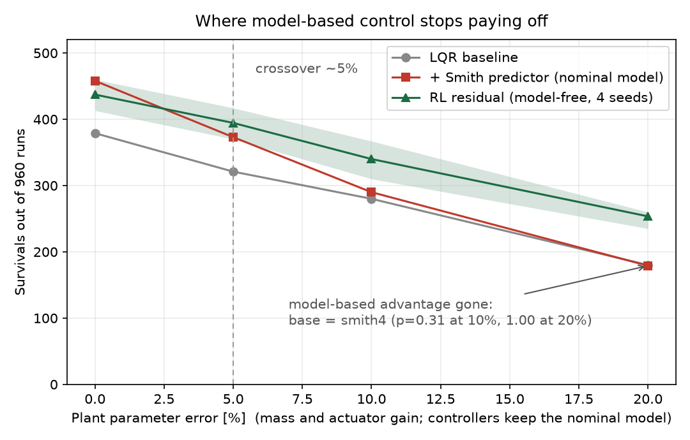

# osbike: low-speed bicycle self-balancing with a moving mass and a free fork

A simulated bicycle that balances, steers and rides off from a standstill at walking
speed, with no steering motor. The only balance actuator is a 2 kg mass sliding sideways
on a rail; the front fork is completely passive and free to castor. Steering happens
because the bike leans and the fork follows.

The project asks one question:

> **A model-based controller needs a model. How wrong can that model be before the
> model-free alternative is the better choice?**

This is not the usual framing of "classical versus learned". It splits the problem into
two regimes and asks which algorithm belongs in each. The answer is a crossover, and it
sits at a specific, measurable place:

<p align="center">
  <br>
  <em>Each point is 960 runs; the band is the spread over 4 training seeds.</em>
</p>

**Where the model holds, classical control wins and learning is not worth its cost.**
Given exact parameters, a Smith predictor scores 458 of 960 against 437 for the learned
policy, and beats it or ties it on every training seed.

**Where the model breaks, the ordering inverts.** By 10% parameter error the delay
compensator scores the same as no compensation at all, and the domain-randomised policy
leads by 50 to 74 runs. The crossover is near 5%.

Everything below is scored by one committed harness on identical terrain seeds, so both
sides are graded the same way.

---

## The plant

| | reaction wheel (scaffold) | **moving mass + free fork (research target)** |
|---|---|---|
| balance actuator | flywheel | **2 kg mass on a ±0.15 m rail, force input** |
| steering | active steer motor | **free fork, no actuator, self-steering only** |
| model | [`assets/reaction_wheel_bicycle.xml`](assets/reaction_wheel_bicycle.xml) | [`assets/moving_mass_bicycle.xml`](assets/moving_mass_bicycle.xml) |

Shared physics: M = 13.2 kg, CoM height 0.52 m, roll inertia about 4.2 kg·m², open-loop
unstable time constant tau = 0.25 s, 12° caster giving 74 mm trail, 1.6 cm tyres. That
last number makes it a genuine inverted pendulum: the static tipping basin is
`atan(half-width / h)`, about 0.9°, which matches measurement.

The reaction-wheel bike is scaffolding, used to get the simulation and the LQR design
path correct on an easier problem. All research claims are on the moving-mass plant.
[`src/mm/mm_sanity.py`](src/mm/mm_sanity.py) is a regression test pinning the plant's
physics: DOF indices, absence of spurious internal contacts, trail, inverted-pendulum
fall time, and the sign of self-steering.

### The control-authority limits

These are properties of the machine, and no controller crosses them.

- **Minimum balancing speed is about 0.65 m/s**, and it is *independent* of actuator
  force (60 to 200 N) and stroke (±0.15 to 1 m). It is a self-steering limit, so the
  lever for lowering it is fork geometry, not a bigger actuator.
- **Force threshold is 50 N.** At 20 N the controller degenerates into 2 Hz bang-bang;
  at 50 N and above it becomes smooth 0.1 Hz motion with zero saturation. Adding mass
  without force makes it worse. Minimum viable hardware: 2 kg, ±0.15 m, 50 N.
- **Head-on climbing has two independent limits.** 10° needs rear torque of at least
  7 N·m *and* approach speed of at least 2.5 m/s. Below that it falls at the same instant
  regardless of torque, because nose-up pitch eats the caster angle (effective caster is
  about 12° minus the slope, so trail drops from 74 mm to about 12 mm) and `v_min` climbs
  from 0.65 to about 2.2 m/s.
- Static balance at v = 0 is impossible: a finite-stroke reaction mass runs out of travel.

---

## The scoring harness

[`src/mm/mm_envelope.py`](src/mm/mm_envelope.py) fixes the protocol in committed code so
every controller is graded identically: v = 1.5 m/s, +30° turn, 30 s survival, 250 Hz
physics with 50 Hz ZOH control, terrain severity as (side slope, friction, bump height),
40 seeds per cell, 960 runs per configuration.

Three protocol constraints, each of which changes what the numbers mean:

- **Delays are integer multiples of the 4 ms physics step.** Any other value is silently
  quantised, so a nominal 5 or 10 or 15 ms grid does not measure what it claims to.
- **Friction is set on the floor *and* both wheels.** MuJoCo takes the element-wise max
  of the two geoms' friction, so setting only the floor leaves the wheel value in force
  and the friction axis does nothing.
- **Survival alone is cheatable.** A controller can "survive" by abandoning its heading
  and coasting downhill, which scores well while going nowhere. The harness records
  crosstrack and yaw alongside survival, and every controller is held to the same
  course-keeping requirement.

---

## Regime 1: the model is valid

With exact parameters, classical control solves the nominal task outright. The design
path matters here: finite-difference linearisation was abandoned because perturbing a
free-joint roll against a hard tyre contact mixes contact normal stiffness into `A`,
producing meaningless gains. An analytic pendulum model about the contact line gives
`A[1,0] = Mgh/I = 16.0`, matching the open-loop measurement.

That baseline handles standing starts, balance down to 0.65 m/s, mass-induced
countersteer turns, 5° side slopes, ice, 5 cm bumps, and combined disturbances up to
moderate severity, holding a median crosstrack of 0.09 m.

Its one real weakness is actuator delay, and a model-based compensator removes it. On
s0.5 terrain (2° slope, friction 0.9, 2 cm bumps), 30 s survival percentage:

| controller | 0 ms | 4 ms | 8 ms | 12 ms | 16 ms | 20 ms |
|---|---|---|---|---|---|---|
| LQR baseline | 98 | 100 | 98 | 55 | 10 | 5 |
| plus Smith predictor | 98 | 95 | 85 | **95** | **88** | **52** |

The predictor lifts 12 ms from 55 to 95% and 16 ms from 10 to 88%, so combined terrain
and delay is not a hard classical bound as long as the model is right.

In this regime the model-based controller is not merely adequate, it is the best thing in
the repository: 458 of 960 against 379 for the plain baseline and 437 ± 23 for the
learned policy. Per training seed the predictor beats the policy twice and ties it twice,
and never loses.

---

## Regime 2: the model is wrong

Two ways to break the model, with different failure signatures.

### The compensator inverts

Inject a systematic error into the predictor's model only, leaving plant and gains
nominal (40 seeds, s0.5 terrain):

| slider mass error | 8 ms | 12 ms | 16 ms | s0.5 overall |
|---|---|---|---|---|
| exact | 85 | 95 | 88 | **85.4** |
| +2% | 95 | 100 | 68 | 77.1 |
| **+5%** | 90 | 65 | 5 | **60.0** |
| **+10%** | 55 | 10 | 0 | **43.3** |
| +20% | 8 | 0 | 0 | 32.9 |

Uncompensated survival is 60.8. At +5% the compensation has bought exactly nothing, and
at +10% it is **worse than not compensating at all**: the predictor confidently rolls the
state forward using dynamics the plant does not have, and acts on the result.

The sign of the error matters more than its size. Under *random* per-seed error of the
same magnitude the predictor stays ahead at every level, because the draws average out.
It is systematic error, the kind a miscalibrated mass or actuator gain produces, that
inverts the compensation. Sim-to-real error is systematic.

Adding states makes this worse, not better. A 6-state DMDc system-ID predictor fits the
data almost perfectly one step ahead, then diverges under multi-step rollout, reaching 0%
beyond 16 ms. Model quality in the sense of extrapolation matters more than state
coverage.

### The advantage disappears

Perturbing the plant while every controller keeps its nominal model is the closest proxy
this simulator has for sim-to-real:

| plant parameter error | LQR baseline | plus Smith predictor | RL residual (4 seeds) |
|---|---|---|---|
| 0% | 379 | **458** | 437 ± 23 |
| 5% | 321 | 373 | **394 ± 23** |
| **10%** | 280 | 290 | **340 ± 30** |
| **20%** | 180 | 179 | **254 ± 12** |

At 10% and 20% the predictor and the plain baseline are statistically indistinguishable
(paired McNemar p = 0.31 and p = 1.00). The entire benefit of delay compensation is gone,
not inverted but simply spent. The learned policy is 50 and 74 runs ahead at those levels,
and this is not a lucky seed: at 20% error all four training seeds beat the predictor
individually (p ≤ 5e-9), and at 10% three of four do, with the fourth at p = 0.052.

### Why the model-free side holds

The policy is a residual on the classical baseline, trained with randomised delay, slope,
friction, mass and actuator gain. It never estimates those parameters explicitly, and
that is precisely why it does not degrade when they are wrong: there is no model to be
wrong about. It pays for this with a ceiling, visible in regime 1, where it cannot reach
a predictor that is handed the truth.

One structural point was necessary to make it work at all. Unknown delay and unknown
dynamics parameters are latent variables, so the problem is a POMDP rather than an MDP.
Identifying them requires the history of *how the state responded to commands*; a single
state frame plus an action history is not enough. The evidence was a policy that
collapsed from 98% to 12% on the zero-delay cells after delay was removed from its
training domain, having baked in a fixed lead correction it could no longer tell was
unnecessary. Stacking 4 core-state frames fixed it. Stacking 8 changes nothing, so this
is a threshold, not a gradient.

### Why it is a residual and not a policy

Removing the classical base and training pure PPO on the same budget (210M steps, same
curriculum) produces a policy that rides flat ground, turns, and handles delay and
parameter noise, and then **scores 0% on every envelope row**. Every row carries at least
1° of side slope, and cross-slope course holding is the one skill it never finds:
deterministic rollouts inside its own training world fall 0 of 64 on a fixed 2° slope.

Its in-domain episode length looks healthy at 622 ticks, but that is a mixture of long
low-slope episodes and short sloped ones. Under a survival-dominated reward, "drift
downhill and survive a while" is a local optimum, and the policy settles there. Resetting
the exploration noise on curriculum transfer buys 15% in-domain and does not change the
outcome, so this is not an exploration failure.

Cross-slope course holding also took deliberate engineering on the classical side, a lean
schedule with heading integral, a lateral outer loop and slew guards. So the division of
labour is not arbitrary: the classical prior contributes exactly the structured skill that
search does not find, and the learned residual contributes the parameter robustness the
fixed design lacks. Neither component reaches the composite alone.

---

## How precisely can any of this be measured

Two noise sources were quantified before trusting any comparison, and both turned out to
matter more than expected.

**The harness is knife-edge per run, stable in aggregate.** Perturbing only the LQR gains
by ±0.5%, changing nothing else, leaves the total almost unmoved (379 to 377) but flips
**66 of 960 individual runs**, 32 one way and 34 the other. Near s0.5 a 0.5% gain change
turns a seed that completes 30 s into one that falls at 3.7 s. Because the flips are
sign-symmetric they cancel, so totals are stable to about ±8 runs (1σ) while per-cell
results are close to a coin toss.

**The training seed dominates.** Four retrainings of the identical configuration score
423, 413, 460 and 453: **1σ ≈ 23 runs, three times the harness noise.**

Two consequences bound what this setup can claim. Per-cell statements of the form "this
controller is better in N of 24 cells" are not supportable at 40 seeds, because the flip
noise is of the same size. And any single-seed total carries a ±23 uncertainty it does
not show. The crossover above is therefore reported as totals with seed spread rather
than as cell-by-cell wins.

---

## What this does and does not show

Given an exact model there is no reason to reach for a learned policy on this machine.
Once the model is wrong by more than a few percent the model-based machinery stops paying
for itself, and the domain-randomised policy is the only thing still holding. That is a
claim about model error, not about balancing.

Whether it matters for a real bicycle depends on whether real-hardware equivalent error
clears 5%. That is an empirical question about the physical machine and it is not
answered here.

One asymmetry is worth stating plainly: the classical side received a strong attempt at
delay compensation and no attempt at robustification. Until an adaptive or
online-identified predictor has been tried, the honest claim is that *a fixed
nominal-model Smith predictor* degrades, not that model-based control degrades.

---

## Repository layout

```
assets/            MuJoCo plants (moving-mass research target, reaction-wheel scaffold)
params/            committed gains and system-ID
results/
  envelopes/       scored envelopes, the raw evidence behind every table above
    robust/        model-error and plant-perturbation axes
    rl/            learned-policy scorings
  figures/         survival maps and the crossover plot
docs/              chronological lab notebook (Korean), including negative results
src/
  mm/              research stack: moving mass + free fork
    mm_model.py        plant load, signal indices, model variants
    mm_controller.py   cascade: balance / heading / speed (pure JAX)
    mm_lqr.py          4-state analytic LQR design
    mm_delay.py        Smith predictors (analytic and DMDc) and system ID
    mm_envelope.py     the shared scoring harness
    mm_robust_sweep.py, mm_robust_table.py, mm_noise_floor.py
    mm_plot_envelope.py, mm_plot_robust.py, mm_metrics.py, mm_climb.py
    mm_sanity.py       regression test (run this first)
    mm_env.py          MJX batch environment and domain randomisation
    mm_ppo.py          dependency-free PPO (about 300 lines of JAX)
    mm_policy.py       checkpoint to numpy inference, CPU deployment bridge
  rw/              reaction-wheel scaffold
  bench/           MJX throughput probes
```

Modules keep their `mm_` prefix so that every filename referenced in the lab notebook
still resolves.

## Running it

```bash
uv venv && uv pip install -e .

python src/mm/mm_sanity.py                                   # regression test, start here
python src/mm/mm_lqr.py                                      # re-derive the LQR gains
python src/mm/mm_envelope.py --seeds 40 --workers 12         # rescore the baseline
python src/mm/mm_envelope.py --ctrl smith4                   # delay-compensated
python src/mm/mm_envelope.py --param-err 0.10                # break the model
python src/mm/mm_envelope.py --gain-jitter 0.005             # measure the noise floor
python src/mm/mm_robust_sweep.py --axis pred --ctrl base smith4
python src/mm/mm_noise_floor.py                              # paired tests vs noise
python src/mm/mm_plot_robust.py                              # the crossover figure
```

Scripts resolve paths from the repository root, so they run from any working directory.
A full 40-seed envelope is 960 thirty-second simulations, a few minutes on a worker pool.

**Not included:** RL checkpoints and training logs are gitignored, so `--ctrl rl` needs a
locally trained policy. The scored envelope JSONs under `results/envelopes/` are the
committed evidence for the learned-controller rows; everything classical reproduces from
source.

## Lab notebook

`docs/` is the primary record, written in Korean and kept chronological on purpose,
including entries that were later overturned and experiments that did not work.

- [`docs/SUMMARY.md`](docs/SUMMARY.md): conclusions, synthesised
- [`docs/PROGRESS.md`](docs/PROGRESS.md): current state and open items
- [`docs/progress/mm.md`](docs/progress/mm.md): the research plant, in detail
- [`docs/progress/rl.md`](docs/progress/rl.md): the RL experiment ledger

## Status

The classical baseline is complete, and the crossover between the two regimes has been
measured. Open, in order of how much they would change the conclusions:

1. **Real-hardware system ID.** Everything turns on whether the physical bike's
   equivalent parameter error clears ~5%. That number is asserted, not measured.
2. **A robustified classical arm**, so the regime-2 claim is about model-based control
   rather than about one fixed-model compensator.
3. **Separate tuning and reporting seeds** for the deploy-scale choice, which was selected
   on the same 40 seeds used to report it.
4. **Re-grid the severity ladder.** Of 24 cells, 8 are zero for every controller and 4 are
   saturated, so only 12 carry information.
5. **Quantify the bump proxy.** Training used random pushes because MJX cannot do
   heightfield-against-cylinder contact, while scoring uses real bumps.
