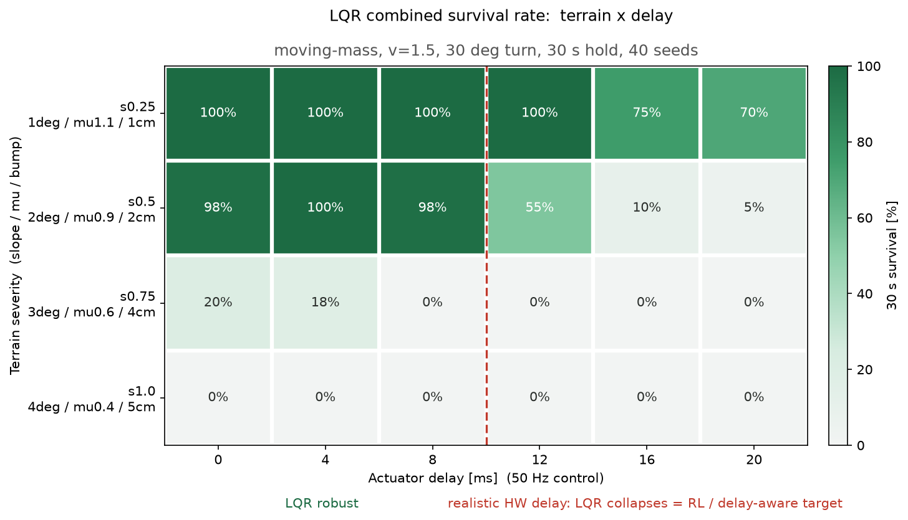
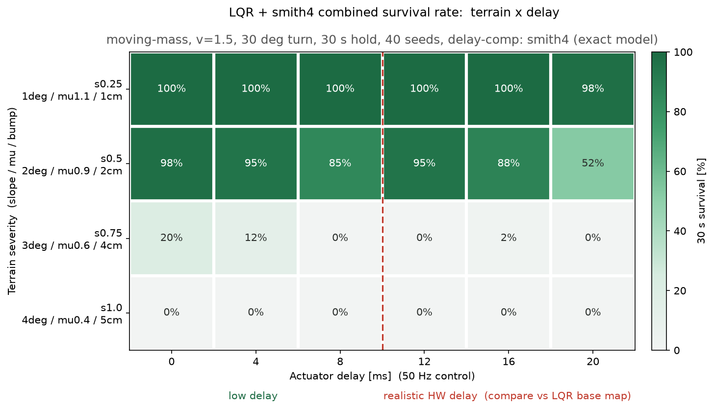
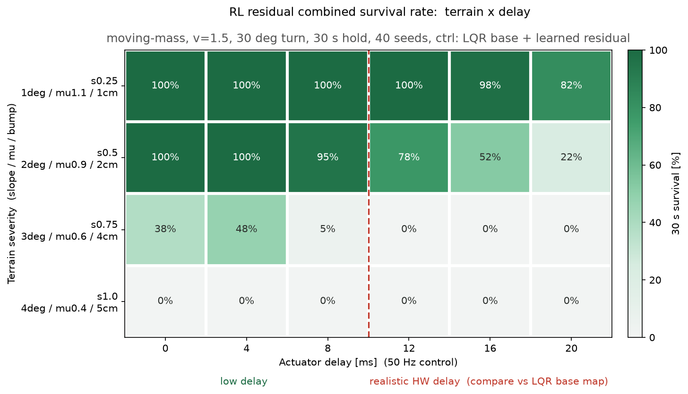

# osbike: low-speed bicycle self-balancing with a moving mass and a free fork

A simulated bicycle that balances, steers and rides off from a standstill at walking
speed, with no steering motor. The only balance actuator is a 2 kg mass sliding
sideways on a rail; the front fork is completely passive and free to castor. Steering
happens because the bike leans and the fork follows.

The project is built around one question:

> **Where exactly does classical control stop being enough, and is that boundary
> a property of the physics or of the controller?**

To answer it honestly the classical baseline is pushed as hard as it will go *before*
any learning is attempted, and both controllers are scored by the same committed
harness on the same terrain seeds. More than once this reversed a conclusion I had
already written down, including one in favour of the classical controller and one
against my own learned one.

<p align="center">
  <br>
  <em>The classical baseline's operating envelope. 960 runs (4 terrains x 6 delays x 40 seeds).</em>
</p>

---

## The plant

| | reaction wheel (scaffold) | **moving mass + free fork (research target)** |
|---|---|---|
| balance actuator | flywheel | **2 kg mass on a ±0.15 m rail, force input** |
| steering | active steer motor | **free fork, no actuator, self-steering only** |
| model | [`assets/reaction_wheel_bicycle.xml`](assets/reaction_wheel_bicycle.xml) | [`assets/moving_mass_bicycle.xml`](assets/moving_mass_bicycle.xml) |

Shared physics: M = 13.2 kg, CoM height 0.52 m, roll inertia about 4.2 kg·m²,
open-loop unstable time constant **tau = 0.25 s**, 12° caster giving **74 mm trail**,
1.6 cm tyres. That last number makes it a genuine inverted pendulum: the static
tipping basin is `atan(half-width / h)`, about 0.9°, which matches measurement.

The reaction-wheel bike is scaffolding. It exists to get the simulation, the LQR
design path and the rendering stack correct on an easier problem. All research
claims are on the moving-mass plant.

### Two model bugs that invalidated earlier numbers

Both were latent from the very first commit, and finding them mattered more than
any controller change.

1. **A 1.9 kN phantom brake.** The downtube capsule penetrated the front wheel disc
   by 33 mm, so every step applied about 1886 N of normal force to the front tyre.
   MuJoCo's `filterparent` only excludes parent/child pairs, and frame/front_wheel is
   grandparent to grandchild. This, not scrub or rolling resistance, was why the bike
   could not hold speed. Fixed with an explicit `<contact><exclude>`.
2. **`trail = 0`.** The v1 steering axis was vertical, so there was no self-steering
   at all and the fork jammed against its stops. A 12° caster (74 mm trail) created
   the mechanism the whole project depends on.

`src/mm/mm_sanity.py` is a regression test that pins both down, along with DOF indices,
trail, inverted-pendulum fall time, and the sign of self-steering, so they cannot
come back silently.

---

## What classical control already solves

Design path: finite-difference linearisation was **abandoned**. Perturbing a free-joint
roll against a hard tyre contact mixes contact normal stiffness into `A` (`A[1,0]` came
out at about 194, which is physically meaningless) and produced 4-digit gains that
saturated permanently. Replacing it with an **analytic pendulum model about the contact
line** gave `A[1,0] = Mgh/I = 16.0`, matching the open-loop measurement, and a
well-conditioned discrete-Riccati solution.

| capability | result |
|---|---|
| standing start, accelerate, cruise | yes, passes safe speed at 0.78 s |
| straight-line balance | yes, **v >= 0.65 m/s** (0.70 with the heading loop closed) |
| turning by mass-induced countersteer | yes, 40° settle, sideslip below 3.5° |
| isolated disturbances | yes: 5° side slope, 4° climb, mu = 0.1 (ice), bumps 5 cm and over |
| combined disturbance, no delay | yes to about s0.5 (98%); s0.75 collapses to 20% |
| course keeping on a slope | yes, median \|crosstrack\| **0.09 m**, down from 30.5 m |

### Control authority, the numbers that constrain hardware

- **Minimum balancing speed is about 0.65 m/s**, and it is *independent* of actuator
  force (60 to 200 N) and stroke (±0.15 to 1 m). It is a self-steering limit, so the
  lever for lowering it is **fork geometry, not a bigger actuator**.
- **Force threshold is 50 N.** At 20 N the controller degenerates into 2 Hz bang-bang
  (human-likeness 1/5); at 50 N and above it becomes smooth 0.1 Hz motion with zero
  saturation (5/5). A 20 N spec was the root cause of nearly every pathology in the
  early sessions. Adding mass without force makes it *worse*.
- **Minimum viable hardware: 2 kg, ±0.15 m, 50 N.**
- **Head-on climbing has two independent limits.** 10° needs rear torque of at least
  **7 N·m** *and* approach speed of at least **2.5 m/s**. Below that it falls at the
  same instant regardless of torque, because nose-up pitch eats the caster angle
  (effective caster is about 12° minus the slope, so trail drops from 74 mm to about
  12 mm) and `v_min` climbs from 0.65 to about 1.2 (5°) to about 2.2 m/s (10°).

---

## The scoring harness

Everything below is scored by [`src/mm/mm_envelope.py`](src/mm/mm_envelope.py), which
fixes the protocol in committed code so the classical and learned controllers are
graded identically: v = 1.5 m/s, +30° turn, 30 s survival, 250 Hz physics with 50 Hz ZOH
control, terrain severity as (side slope, mu, bump height), 40 seeds per cell.

Three protocol details that each fixed a real measurement error:

- **Delays must be integer multiples of the 4 ms physics step.** The earlier 5/10/15 ms
  grid was being silently quantised, so those labels were fiction.
- **Friction has to be set on the floor *and* both wheels.** MuJoCo takes the
  element-wise max of the two geoms' friction, so lowering only the floor let the
  wheels' mu = 1.4 win and the entire friction axis did nothing.
- **Survival alone is a cheatable metric.** A controller can "survive" by abandoning its
  heading and coasting downhill, and the old baseline genuinely did this, drifting a
  median of 30 m. The harness therefore records crosstrack and yaw alongside survival,
  and both controllers are held to the same course-keeping requirement.

Seed count matters. The original 3-seed map was non-monotonic (0 pass, 10 fail, 15 pass,
20 fail). At 40 seeds that non-monotonicity vanished entirely. It was all sampling
noise, and several per-cell claims built on it had to be withdrawn.

---

## Three-way comparison

All numbers below are 30 s survival percentages, 40 seeds per cell, regenerated from the
committed JSON in [`results/envelopes/`](results/envelopes).

Bold marks the best controller in each column. Neither approach wins outright.

**s0.5 terrain (2° slope, mu 0.9, 2 cm bumps), the delay axis:**

| controller | 0 ms | 4 ms | 8 ms | 12 ms | 16 ms | 20 ms |
|---|---|---|---|---|---|---|
| LQR baseline | 98 | **100** | **98** | 55 | 10 | 5 |
| plus Smith predictor (exact model) | 98 | 95 | 85 | **95** | **88** | **52** |
| RL residual (model-free) | **100** | **100** | 95 | 78 | 52 | 22 |

**s0.75 terrain (3°, mu 0.6, 4 cm), the terrain axis, where delay barely matters:**

| controller | 0 ms | 4 ms | 8 ms |
|---|---|---|---|
| LQR baseline | 20 | 18 | 0 |
| plus Smith predictor | 20 | 12 | 0 |
| RL residual | **38** | **48** | **5** |

**Totals over all 960 runs: baseline 379, Smith predictor 458, RL residual 447.**
On nominal simulation the Smith predictor is the strongest controller in the repository,
and the RL policy does not beat it.

<p align="center">
  
  
</p>

### Reading these tables

**The classical controller was wrong about its own limit.** I had recorded a
"combined terrain and delay cap at 10 to 15 ms" as a hard classical bound. It was an
artifact of a weak baseline and 3 seeds. A Smith predictor on the *strong* baseline
nearly closes the gap: 55 to 95% at 12 ms, 10 to 88% at 16 ms. The claim was retracted.

**But the predictor is brittle in exactly the way that matters.** Injecting parameter
error into the predictor's model only, leaving plant and gains untouched:

| slider mass error | 12 ms | 16 ms |
|---|---|---|
| exact | 10/10 | 9/10 |
| +2% | 9/10 | 7/10 |
| **+5%** | 6/10 | **0/10** |
| ±10% | 4/10 or below | 1/10 or below |
| ±20% | 0/10 | 0/10 |

Uncompensated survival is 55% and 10%, so **at 5 to 10% model error the Smith predictor
is worse than no compensation at all**. The compensation inverts. Real-hardware
equivalent error (actuator gain, belt losses, friction, tyre) clears 5% easily. So
model-based delay compensation is bottlenecked by *robustness*, not accuracy, and it
fails precisely where sim-to-real bites. Adding states made it worse, not better: a
6-state DMDc system-ID predictor fit the data almost perfectly one step ahead and then
diverged under multi-step rollout, reaching 0% beyond 16 ms.

**The RL policy clears the baseline but not the predictor, and the split is
structured.** A residual policy (classical LQR plus a learned correction) beats the
baseline in 8 of 24 cells, ties 15, and is worse in exactly one: s0.5 at 8 ms, 38/40
against 39/40, a single seed. Against the Smith predictor it wins 6 cells and loses 6,
and finishes 11 runs behind on the total.

Which 6 it loses is the interesting part. The predictor takes the entire high-delay end
(s0.5 at 12, 16 and 20 ms, by 18 to 35 points) and the RL policy takes the entire s0.75
terrain row (by 18 to 35 points), where the predictor gains nothing at all over the
baseline. That is not noise dividing them, it is the two methods solving different
problems: an exact-model predictor is precisely the right tool for a known delay, and
useless against terrain its reduced model does not represent.

So the honest reading is that the learned controller is *cheaper*, not better. It
matches roughly the same total while needing no model, holding the same course (median
crosstrack 0.10 m against the baseline's 0.09 m), and never having seen real bump
geometry in training, since MJX cannot do heightfield-against-cylinder contact and
training used random pushes as a proxy. Whether that translates into an actual advantage
depends on the model-error axis, where the predictor is known to invert and the policy
has **not yet been measured**. That evaluation is the main open item below, and until it
is run the case for learning here rests on the s0.75 terrain column alone.

---

## What the RL work actually taught me

The learning results are less interesting than the two diagnoses that produced them.

**1. Unknown delay makes this a POMDP, and a single state frame cannot see it.**
Domain-randomised delay and dynamics parameters are latent variables. Identifying them
requires the *history of how the state responded to commands*, and one frame plus an
action history is not enough. The evidence was a policy that collapsed from 98% to 12%
on the zero-delay cells after delay was removed from its training domain: it had baked
in a fixed lead correction and could not tell it was no longer needed. Stacking 4
core-state frames took episode length from 400 to 732 in the identical domain.

**2. An unanchored residual finds an over-actuation local optimum.** With residual
scale 1.0 the policy settled into an aggressive oscillation mode, 3 to 5° lean RMS on
flat ground where the baseline holds 0.1°. Averaged over a hard domain this still
scored well, so training never corrected it, but it sacrificed all the easy cells.
Halving the residual at *deployment* recovered them instantly (lean 0.52°, all delays
completed). The direction was right and only the magnitude was wrong.

**3. Learning big and deploying damped beat learning small.** Retraining at scale 0.5
with a residual-magnitude penalty (`res_v3`) *lost* to the scale-1.0 policy deployed at
0.5: 82/62/20/10 against 95/78/52/22 on s0.5. Wide exploration followed by amplitude
removal outperformed a directly constrained search. A deploy-scale sweep put the safe
band at 0.4 to 0.6, and 0.5 is the point where "no cell is worse than baseline" holds.

**4. An uncapped penalty term stalls learning.** A `-50 * lean^2` term uncapped reached
-30 per step during a fall, so returns were dominated by a stretch where actions no
longer mattered; advantages became noise and KL sat at about 0.001 for 19M steps.
Capping it at `-50 * min(lean^2, 0.02)` started learning immediately. Uncapped, it also
risks a suicide equilibrium where dying fast is optimal.

Infrastructure notes: PPO is about 300 lines of pure JAX, with no flax, optax or brax,
to avoid a dependency pin conflict. It peaks at 48.5k steps/s at 16384 parallel envs on
an RTX 4060 Ti, and that peak sits right at the 8 GB VRAM cliff. JAX deadlocks under
`fork`, so CPU evaluation pools must use `spawn`.

---

## Physical limits, where neither approach helps

Worth stating separately, because these are properties of the machine and no controller
crosses them: static balance at v = 0 (a finite-stroke reaction mass runs out of
travel), anything below `v_min`, side slopes past about 5° (stroke), climbs past about
4° at stock torque, and hard turns (tyre lateral slip).

**RL is not what makes this bicycle stand up.** Classical control does all of the
nominal task, the combined terrain and delay problem is nearly closed by a Smith
predictor given an exact model, and on nominal simulation that predictor still scores
higher than the learned policy. All three of those are results in their own right.

The remaining case for learning is narrow and, so far, only half measured: it holds the
s0.75 terrain column outright, where every model-based option collapses to the
baseline, and it is the natural candidate for the **model-error axis**, where the
predictor is known to invert. The second half of that claim is a hypothesis until the
randomised-parameter evaluation is run. Stating it as a finding would be exactly the
weak-baseline overclaim this project was set up to avoid.

---

## Repository layout

```
assets/            MuJoCo plants (moving-mass research target, reaction-wheel scaffold)
params/            committed gains and system-ID (lqr, mm_lqr, mm_sysid_6state)
results/
  envelopes/       15 scored envelopes, the raw evidence behind every table above
  figures/         survival maps rendered from those JSONs
docs/              chronological lab notebook (Korean), see below
src/
  mm/              research stack: moving mass + free fork
    mm_model.py        plant load, signal indices, model variants
    mm_controller.py   cascade: balance / heading / speed (pure JAX)
    mm_lqr.py          4-state analytic LQR design
    mm_delay.py        Smith predictors (smith4 analytic, smith6 DMDc) and system ID
    mm_envelope.py     the shared scoring harness
    mm_plot_envelope.py, mm_metrics.py, mm_authority_sweep.py, mm_climb.py
    mm_sanity.py       regression test (run this first)
    mm_env.py          MJX batch environment and domain randomisation
    mm_ppo.py          dependency-free PPO (about 300 lines of JAX)
    mm_policy.py       checkpoint to numpy inference, CPU deployment bridge
    mm_render.py       video rendering
  rw/              reaction-wheel scaffold (model, controller, lqr, rollout, sweep, viz)
  bench/           MJX throughput probes used to size the training batch
```

Modules keep their `mm_` prefix so that every filename referenced in the `docs/` lab
notebook still resolves. Only the invocation path changed: `python mm_envelope.py ...`
is now `python src/mm/mm_envelope.py ...`.

## Running it

```bash
uv venv && uv pip install -e .          # or: pip install -e .

python src/mm/mm_sanity.py                              # regression test, start here
python src/mm/mm_lqr.py                                 # re-derive the LQR gains
python src/mm/mm_envelope.py --seeds 40 --workers 12    # rescore the baseline (hours)
python src/mm/mm_envelope.py --ctrl smith4              # delay-compensated ablation
python src/mm/mm_plot_envelope.py results/envelopes/envelope_lqr_klat.json
python src/mm/mm_render.py 1.5 ride.mp4 20              # video
```

Scripts resolve paths from the repository root, so they run from any working directory.
`mm_sanity.py` and `mm_lqr.py` are cheap; a full 40-seed envelope is 960 thirty-second
simulations and wants the worker pool.

**Not included:** RL checkpoints (`ckpt/`) and wandb logs are gitignored and are not in
this repository, so `--ctrl rl` cannot be re-run from a clean clone. The scored envelope
JSONs in `results/envelopes/` are the committed evidence for the learned-controller rows.
Everything classical reproduces from source.

## Lab notebook

`docs/` is the primary record and is written in Korean. It is kept chronological
on purpose, including the entries that were later overturned.

- [`docs/SUMMARY.md`](docs/SUMMARY.md): conclusions, synthesised
- [`docs/PROGRESS.md`](docs/PROGRESS.md): current state and open items
- [`docs/progress/mm.md`](docs/progress/mm.md): the research plant, in detail
- [`docs/progress/rl.md`](docs/progress/rl.md): the RL experiment ledger
- [`docs/progress/lqr.md`](docs/progress/lqr.md), [`docs/progress/plant.md`](docs/progress/plant.md): scaffold

## Status

The classical baseline is complete. The residual RL controller clears it (447 against
379 of 960 runs, one cell worse by a single seed) but does not clear the Smith predictor
(458) on nominal simulation.

The next experiment is the one that decides the question: a three-way evaluation under
injected parameter error, the axis where the predictor is known to invert to
worse-than-nothing and the learned policy is untested. If the policy holds there, the
model-free route is justified on robustness; if it does not, the honest conclusion is
that classical control with a good model wins this problem outright. After that,
real-hardware system ID to calibrate the simulator, and tightening the passive
self-stability speed window against Whipple.
